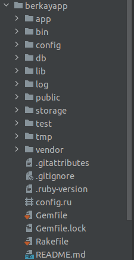

## DOSYA DİZİN YAPILARI

Rails projemizi oluşturmak için terminal üzerinde `rails new appname -d=postgresql` yazmamız yeterlidir.
Buradaki `appname` kısmı proje adı, `-d=postgresql` seçeneği ise PostgreSQL'i veritabanı olarak ayarlar. 
Bu komutu çalıştırdıktan sonra, Rails uygulamasının tüm öğelerini içeren `appname` adlı yeni bir klasör görünür.

- app:
Bu klasörde uygulamamız için controllers, model, views, yardımcıları, postaları, kanalları, işleri ve varlıkları içerir.
- bin : Uygulamamızı başlatan ve uygulamamızı kurmak, güncellemek, dağıtmak veya çalıştırmak için kullandığınız diğer komut dosyalarını içerebilen Rails komut dosyasını içerir.
- config : Bu klasörde uygulamamızın çalışma kuralları, yolları, veritabanı ve yapılandırma dosyaları bulunur.
- db : Geçerli veritabanı şeması, ve veritabanı geçişleri için birleştirmeleri (Migration) içerir.
- lib : Uygulamamız için modüller bulundurur.
- log : Uygulamamızın log dosyaları bulunur. 
- public : Dışarıdan, oldukları şekilde ulaşılabilen dosyalar buradadır. Burada statik dosyalarımız bulunur, tüm resimleriniz, javascriptleriniz, stilleriniz vs.
- storage: Disk Hizmeti için aktif depolama dosyaları.
- test : Birim testleri , bağlayıcılar ve diğer test yardımcılarını içerir.
- tmp : Geçici dosyaları barındırır. 
- vendor : Tüm 3. parti yazılımları buradadır. Tipik bir Rails uygulamasında, Gem dosyaları,pluginler ve projenizin içine gömecekseniz Rails kaynak kodu bulunur.
- .gitignore : Bu klasörde git'e hangi dosyaları göz ardı etmesi gerektiğini söyleriz.
- .ruby-verison : Bu dosya varsayılan ruby sürümünü içerir.
- config.ru : Rack temelli suncucular için uygulamayı başlatmak için konfigürasyonlar içerir.
- Gemfile : Bu dosya Rails uygulamamızın bağlantılı olduğu Gem’leri belirtir.
- README : Uygulama için kısa kullanım kılavuzudur. Uygulamamızın ne yaptığını, nasıl yaptığını vb. ayarları için kullanıcılara söylemek istediklerimizi bu dosyaya yazarız.

