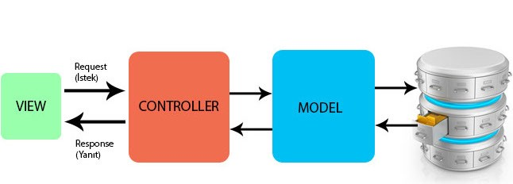

## MVC YAPISI
Rails yazılım mimari deseni olarak MVC(Model(ActiveRecord), View (ActionView), Controller(ActionController)) kullanır.

- Model (ActiveRecord): Model, iş verilerini ve mantığını temsil etmekten sorumlu sistem katmanıdır. 
Veritabanında kalıcı olarak saklanması gereken iş nesnelerinin oluşturulmasını ve kullanılmasını kolaylaştırır. 
Veri katmanını uygulamadan izole eder ve bu sayede diğer katmanların da veri katmanının nerede olduğunu bilmesine gerek kalmaz.
- View (ActionView): View, kullanıcının gördüğü arayüzü içeren katmandır. 
Kullanılan verilerin nereden geldiği ile ilgili bilgisi yoktur.
- Controller(ActionController): Controller, kullanıcının View üzerinden gerçekleştirdiği isteklerle ilgili işlemleri yerine getiren bölümdür. 
Kullanıcının isteği veya işlemleriyle View’den aldığı veriyi Model’e taşır, Model’den aldığı veriyi ise View üzerinden kullanıcıya tekrar götürür. 
Yani Model ve View arasında doğrudan bir ilişki yoktur. 
Son olarak Action Controller, isteğe uygun olarak gerekli yanıtı, istemciye ulaştırmakla yükümlü bölümdür diyebiliriz.

