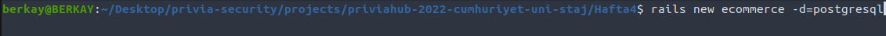
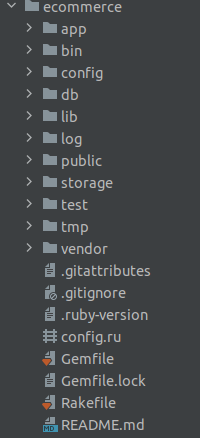
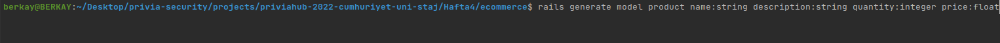
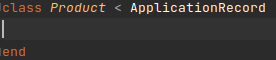
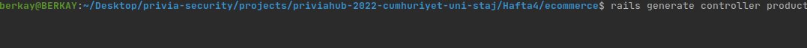
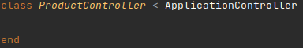
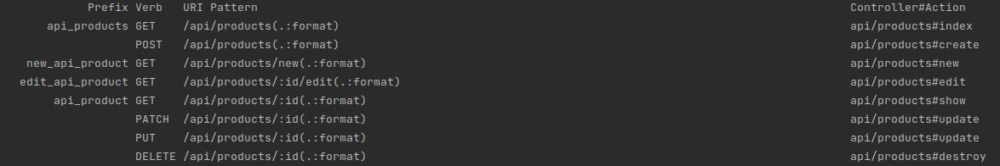
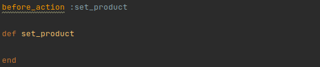
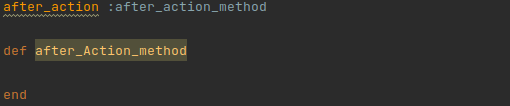
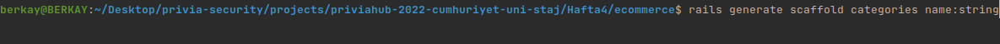

## RAILS PROJE OLUŞTURMA
Rails projemizi oluşturmak için terminal üzerinde `rails new appname` yazmamız yeterlidir.
Projemizin veri tabanını belirtmek istersek `rails new appname -d=postgresql` yazmamız gerekir.
Buradaki `appname` kısmı proje adı, `-d=postgresql` seçeneği ise PostgreSQL'i veritabanı olarak ayarlar.

Örnek olarak;

Bu komutu çalıştırdıktan sonra, Rails uygulamasının tüm öğelerini içeren `appname` adlı yeni bir klasör görünür.
Peki bu klasörler nelerdir şimdi onları inceleyelim.

- app: Bu klasörde uygulamamız için controllers, model, views, yardımcıları, postaları, kanalları, işleri ve varlıkları içerir.
- bin : Uygulamamızı başlatan ve uygulamamızı kurmak, güncellemek, dağıtmak veya çalıştırmak için kullandığınız diğer komut dosyalarını içerebilen Rails komut dosyasını içerir.
- config : Bu klasörde uygulamamızın çalışma kuralları, yolları, veritabanı ve yapılandırma dosyaları bulunur.
- db : Geçerli veritabanı şeması, ve veritabanı geçişleri için birleştirmeleri (Migration) içerir.
- lib : Uygulamamız için modüller bulundurur.
- log : Uygulamamızın log dosyaları bulunur. 
- public : Dışarıdan, oldukları şekilde ulaşılabilen dosyalar buradadır. Burada statik dosyalarımız bulunur, tüm resimleriniz, javascriptleriniz, stilleriniz vs.
- storage: Disk Hizmeti için aktif depolama dosyaları.
- test : Birim testleri , bağlayıcılar ve diğer test yardımcılarını içerir.
- tmp : Geçici dosyaları barındırır. 
- vendor : Tüm 3. parti yazılımları buradadır. Tipik bir Rails uygulamasında, Gem dosyaları,pluginler ve projenizin içine gömecekseniz Rails kaynak kodu bulunur.
- .gitignore : Bu klasörde git'e hangi dosyaları göz ardı etmesi gerektiğini söyleriz.
- .ruby-verison : Bu dosya varsayılan ruby sürümünü içerir.
- config.ru : Rack temelli suncucular için uygulamayı başlatmak için konfigürasyonlar içerir.
- Gemfile : Bu dosya Rails uygulamamızın bağlantılı olduğu Gem’leri belirtir.
- README : Uygulama için kısa kullanım kılavuzudur. Uygulamamızın ne yaptığını, nasıl yaptığını vb. ayarları için kullanıcılara söylemek istediklerimizi bu dosyaya yazarız.

## RAILS - MVC MİMARİSİ İLİŞKİSİ
Ruby on Rails da bir uygulama yapabilmemiz için MVC yapısına ihtiyaç duyarız yani model, view ve controller dosyalarına ihtiyacımız vardır.
Peki model, view ve controller'ın ne olduğuna ve nasıl oluşturabileceğimize bakalım.

##### MODEL
Model, iş verilerini ve mantığını temsil etmekten sorumlu sistem katmanıdır.
Veritabanında kalıcı olarak saklanması gereken iş nesnelerinin oluşturulmasını ve kullanılmasını kolaylaştırır.
Veri katmanını uygulamadan izole eder ve bu sayede diğer katmanların da veri katmanının nerede olduğunu bilmesine gerek kalmaz.

Rails'de kendi model dosyamızı `rails generate filename attribut` komutuyla oluşturabiliriz.
`filename` kısmına dosya ismini yazarız, `attribut` kısmına ise özelliklerimizi yazarız.

Örnek olarak;

Bir model, ApplicationRecord'dan miras alan ve diğer herhangi bir sınıf gibi metodlara sahip olan bir Ruby sınıfıdır.

##### VİEW
View, kullanıcının gördüğü arayüzü içeren katmandır.
Kullanılan verilerin nereden geldiği ile ilgili bilgisi yoktur.

##### Controller
Controller, kullanıcının View üzerinden gerçekleştirdiği isteklerle ilgili işlemleri yerine getiren bölümdür.
Kullanıcının isteği veya işlemleriyle View’den aldığı veriyi Model’e taşır, Model’den aldığı veriyi ise View üzerinden kullanıcıya tekrar götürür.

Rails'de kendi controller dosyamızı `rails generate controller filenames` komutuyla oluşturabiliriz.
`filenames` kısmına dosya ismini yazarız.

Not:Oluşturmuş olduğumuz controller dosyamızın adını zorunlu olmasada çogul yazarız

Örnek olarak;

Bir controller, ApplicationController'dan miras alan ve diğer herhangi bir sınıf gibi metodlara sahip olan bir Ruby sınıfıdır.

## RAILS ROUTES YAPISI
MVC içerisinde yer alan routing yapısı gelen web isteklerini(GET, POST...) Controller ile eşleştirir.

`rails routes` komutunu kullanarak aktif olan route'ları ve bu route'larla neler yapılabileceğine bakarız.

## CRUD İŞLEMLERİ
CRUD işlemleri oluşturmuz olduğumuz controller dosyamızda gerçekleştirilir.

- CREATE (OLUŞTUR) : Veritabanına yeni bir öğe eklememizi sağlar.
- READ (OKUMA) : Veritabanında belirli bir değer hakkında bir kayıt olup olmadığını görmemizi sağlar. 
Bu fonksiyon veritabanında herhangi bir bilgiyi değiştirmez, sadece görüntüleme yapabilmemizi sağlar.
- UPDATE (GÜNCELLEME) : Veritabanındaki bir değeri değiştirebiliriz.
- DELETE (SİLME) : Veritabanında istemediğiniz bir kaydı silebiliriz.

## CRUD İŞLEMLERİ API
Dört ana HTTP yöntemi (GET, PUT, POST ve DELETE) CRUD işlemleriyle aşağıdaki gibi eşlenebilir:

- GET: Belirtilen URI'de kaynağın gösterimini alır. GET'in sunucuda hiçbir yan etkisi olmamalıdır.
- PUT: Belirtilen URI'deki bir kaynağı güncelleştirir. Put, istemcilerin yeni URI'ler belirtmesine izin veriyorsa belirtilen URI'de yeni bir kaynak oluşturmak için de kullanılabilir. Bu öğretici için API, PUT aracılığıyla oluşturmayı desteklemez.
- POST: Yeni bir kaynak oluşturur. Sunucu yeni nesne için URI'yi atar ve yanıt iletisinin bir parçası olarak bu URI'yi döndürür.
- DELETE: Belirtilen URI'deki bir kaynağı siler.

Not: PUT yöntemi tüm ürün varlığının yerini alır. Yani istemcinin güncelleştirilmiş ürünün tam bir gösterimini göndermesi beklenir. Kısmi güncelleştirmeleri desteklemek istiyorsanız PATCH yöntemi tercih edilir.

## ACTION CONTROLLER CALLBACKS
Ruby on Rails'de controller'ları yazarken, Before_action ve After_action kullanmak, iş mantığımızı yararlı bir şekilde yapılandırmamızı ve clean kod yazmamızı sağlar.

before_action ile controller'ımızda yapılacak bütün  işlemlerinden önce yapılması gereken metodu belirtiriz.

`set_product` kısmına metodun adını veririz ve metodumuzu yazarız

after_action ile controller'ımızda yapılacak işlemlerden sonra çalışmasını istediğimiz metodu belirtiriz.

`after_action_method` kısmına metodun adını veririz ve metodumuzu yazarız.

## SCAFOLD YAPISI
Scafol yapısı uygulamamız için oluşturmamız gereken model, controller gibi dosyaları tek tek oluşturmamız yerine kendisi bu dosyaları oluşturur.
Rails'de scaffold yapısını kullanabilmemiz için terminal üzerinde `rails generate scaffold Post attribut` yazmamız yeterlidir.
`Post` kısmı dosya adı, `attribut` kısmı ise özelliklerimizi yazarız.
