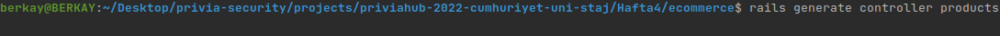

## DOSYA DİZİN YAPILARI

Rails projemizi oluşturmak için terminal üzerinde `rails new appname -d=postgresql` yazmamız yeterlidir.
Buradaki `appname` kısmı proje adı, `-d=postgresql` seçeneği ise PostgreSQL'i veritabanı olarak ayarlar. 
Bu komutu çalıştırdıktan sonra, Rails uygulamasının tüm öğelerini içeren `appname` adlı yeni bir klasör görünür.

- app: Bu klasörde uygulamamız için controllers, model, views, yardımcıları, postaları, kanalları, işleri ve varlıkları içerir.
- bin : Uygulamamızı başlatan ve uygulamamızı kurmak, güncellemek, dağıtmak veya çalıştırmak için kullandığınız diğer komut dosyalarını içerebilen Rails komut dosyasını içerir.
- config : Bu klasörde uygulamamızın çalışma kuralları, yolları, veritabanı ve yapılandırma dosyaları bulunur.
- db : Geçerli veritabanı şeması, ve veritabanı geçişleri için birleştirmeleri (Migration) içerir.
- lib : Uygulamamız için modüller bulundurur.
- log : Uygulamamızın log dosyaları bulunur. 
- public : Dışarıdan, oldukları şekilde ulaşılabilen dosyalar buradadır. Burada statik dosyalarımız bulunur, tüm resimleriniz, javascriptleriniz, stilleriniz vs.
- storage: Disk Hizmeti için aktif depolama dosyaları.
- test : Birim testleri , bağlayıcılar ve diğer test yardımcılarını içerir.
- tmp : Geçici dosyaları barındırır. 
- vendor : Tüm 3. parti yazılımları buradadır. Tipik bir Rails uygulamasında, Gem dosyaları,pluginler ve projenizin içine gömecekseniz Rails kaynak kodu bulunur.
- .gitignore : Bu klasörde git'e hangi dosyaları göz ardı etmesi gerektiğini söyleriz.
- .ruby-verison : Bu dosya varsayılan ruby sürümünü içerir.
- config.ru : Rack temelli suncucular için uygulamayı başlatmak için konfigürasyonlar içerir.
- Gemfile : Bu dosya Rails uygulamamızın bağlantılı olduğu Gem’leri belirtir.
- README : Uygulama için kısa kullanım kılavuzudur. Uygulamamızın ne yaptığını, nasıl yaptığını vb. ayarları için kullanıcılara söylemek istediklerimizi bu dosyaya yazarız.

## RAİLS - MVC MİMARİSİ İLİŞKİSİ
Ruby on Rails da bir uygulama yapabilmemiz için MVC yapısına ihtiyaç duyarız yani model, view ve controller dosyalarına ihtiyacımız vardır.
Peki model, view ve controller'ın ne olduğuna ve nasıl oluşturabileceğimize bakalım.

Model (ActiveRecord): Model, iş verilerini ve mantığını temsil etmekten sorumlu sistem katmanıdır.
Veritabanında kalıcı olarak saklanması gereken iş nesnelerinin oluşturulmasını ve kullanılmasını kolaylaştırır.
Veri katmanını uygulamadan izole eder ve bu sayede diğer katmanların da veri katmanının nerede olduğunu bilmesine gerek kalmaz.

Rails'de kendi model dosyamızı `rails generate filename attribut` komutuyla oluşturabiliriz.
`filename` kısmına dosya ismini yazarız, `attribut` kısmına ise özelliklerimizi yazarız.

Örnek olarak;

View (ActionView): View, kullanıcının gördüğü arayüzü içeren katmandır.
Kullanılan verilerin nereden geldiği ile ilgili bilgisi yoktur.

Controller(ActionController): Controller, kullanıcının View üzerinden gerçekleştirdiği isteklerle ilgili işlemleri yerine getiren bölümdür. 
Kullanıcının isteği veya işlemleriyle View’den aldığı veriyi Model’e taşır, Model’den aldığı veriyi ise View üzerinden kullanıcıya tekrar götürür.
Yani Model ve View arasında doğrudan bir ilişki yoktur.
Son olarak Action Controller, isteğe uygun olarak gerekli yanıtı, istemciye ulaştırmakla yükümlü bölümdür diyebiliriz.

Rails'de kendi controller dosyamızı `rails generate controller filenames` komutuyla oluşturabiliriz.
`filename` kısmına dosya ismini yazarız.

Örnek olarak;

