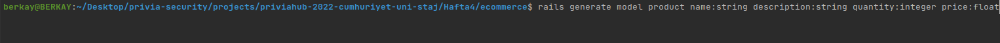
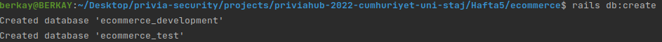
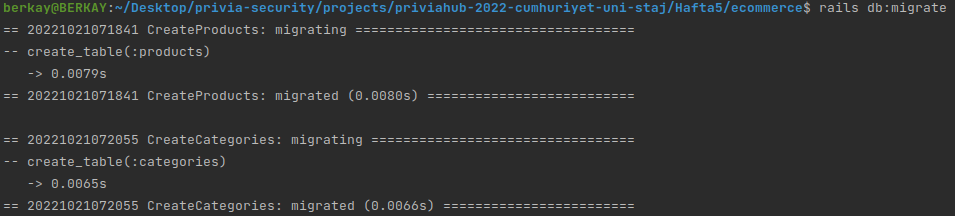
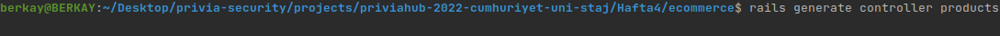
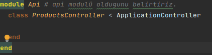
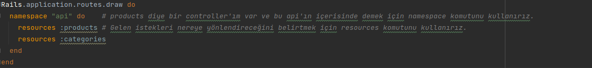
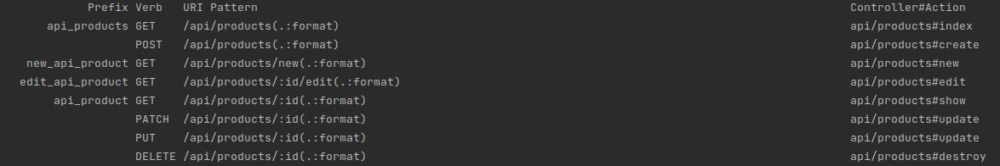
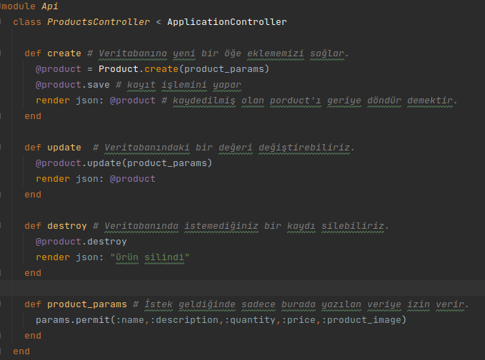
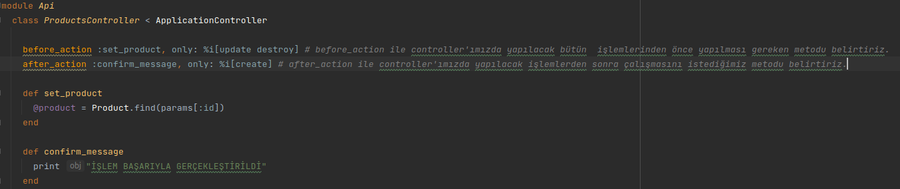

## Rails ve MVC mimarisi ilişkisi
Ruby on rails MVC yapısını kullanır. Rails'de bir proje oluşturabilmemiz için Model, View ve Controller dosyalarına ihtiyacımız vardır.
Şimdi bunları nasıl oluşturacağımızı ögrenelim;

Rails'de kendi model dosyamızı `rails generate model filename attribut` komutuyla oluşturabiliriz.
`filename` kısmına dosya ismini yazarız, `attribut` kısmına ise özelliklerimizi yazarız.

Veritabanı olarak Postgresql kullandığımız için veritabanımızı `rails db:create` diyerek oluşturalım.

Şimdi yazmış olduğumuz modelleri `db:migrate` diyerek veritabanımıza yansıtalım.

Rails'de kendi controller dosyamızı `rails generate controller filenames` komutuyla oluşturabiliriz.
`filenames` kısmına dosya ismini yazarız.

Not:Oluşturmuş olduğumuz controller dosyamızın adını zorunlu olmasada çogul yazarız

Örnek olarak;

## Rails API oluşturulması
Api, uygulamamızla backend altyapımız arasındaki iletişimi sağlayan controllerlar bütünüdür.
Controller klasörümüzün altında api dosyası oluşturalım ve products_controllerı buraya koyalım.

## Rails Routes yapısı

MVC içerisinde yer alan routing yapısı gelen web isteklerini(GET, POST...) Controller ile eşleştirir.
Şimdi bu istekleri controller ile eşleştirmek için route işlemlerini yapalım 

`rails routes` komutunu kullanarak aktif olan route'ları ve bu route'larla neler yapılabileceğine bakarız.

Api dosyamızın içerisind `rails routes` komutu ile bakmış olduğumuz route'lardan bazılarını kullanalım.

## Action Controller Callbackler
Ruby on Rails'de controller'ları yazarken, Before_action ve After_action kullanmak, iş mantığımızı yararlı bir şekilde yapılandırmamızı ve clean kod yazmamızı sağlar.

