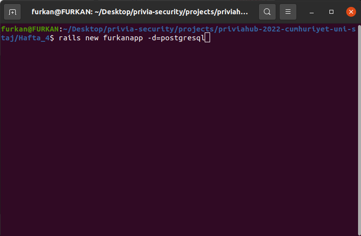
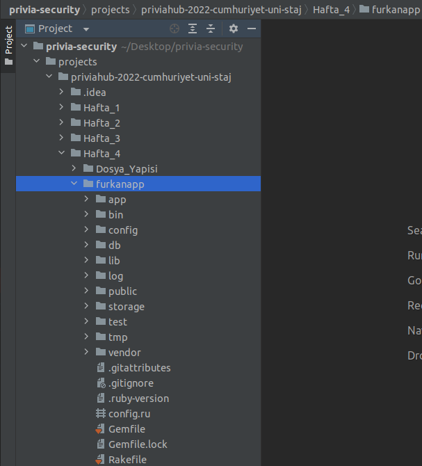
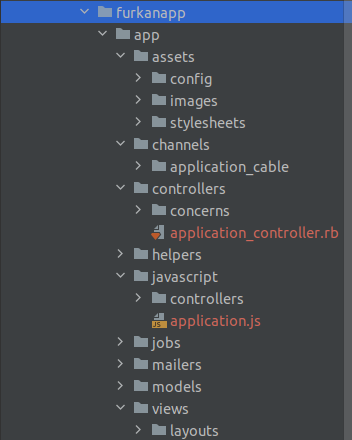
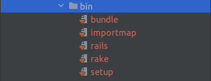
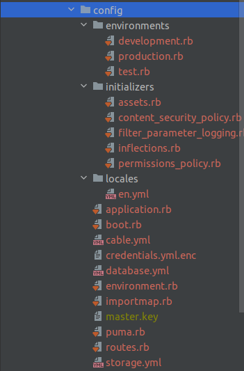
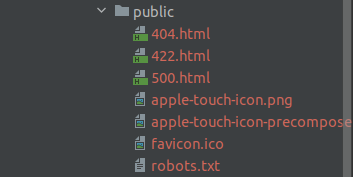
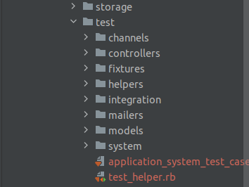
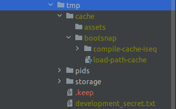
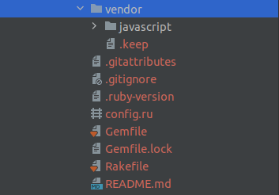

## Rails Projesi Oluşturma

Projemizi oluşturmak istediğimiz dosya dizini içerisinde fotoğrafta belirtilen
komutu çalıştırıyoruz. Bu sayede postgresql veritabanı içeren 
, dosyaları hazır olarak oluşturulmuş "furkanapp" isimli bir rails projesi
karşımıza çıkıyor.

## Dosya Dizin Yapısı
### app/
Bu klasörde temel yapı taşlarımız olan views,
controllers ve models katmanları bulunur.

###### assets/
Uygulamamızda statik olarak bulundurmak istediğimiz dosyaların
bulunduğu dosyadır. Örneğin bir resmi statik olarak tutmak
istiyorsak "assets/images/" altında tutabiliriz.
###### channels/
Web socket kullanarak bir noktadan başka bir noktaya mesaj/veri
gönderme işlemlerini anlık olarak gerçekleştirmemizi sağlayan tüm
dosyalar channels dosyası altında oluşur.
###### controllers/
Kontrol ve karar mekanizmasıdır. View ile model
arasındaki bağlantı kurulur. Kullanıcıdan gelen 
istekler controller’da değerlendirilir, kullanıcıya
dönüş yapılır.
###### helpers/
Yardımcı methodların içerisine yazıldığı dosyadır.
###### models/
Veritabanı ile olan ilişkilerden sorumludur. Veri tabanımızdaki 
her tabloya karşılık uygulamanızda bir model olacaktır.
###### views/
Kullanıcıların gördüğü sayfalardır.
HTML, CSS, javascript.. ve çok basit
php kodlar barındaribilir. Kullanıcıdan
alınan istekleri Controller’a iletmektedir.
## bin/

## config/

Bu klasörde uygulamamızın çalışma kuralları, yolları, veritabanı 
ve yapılandırma dosyaları bulunur.

###### routes/
Gelen isteklerin nereye yönlendirilmesi gerektiğini söyleyen methodları içerir.
## db/

Geçerli veritabanı şeması, ve veritabanı geçişleri için birleştirmeleri 
(Migration) içerir.

## lib/

Uygulamamız için modüller bulundurur.

## log/

Uygulamamızın log dosyalarını bulundurur.

## public/

Dışarıdan , oldukları sekilde ulaşılabilen dosyalar buradadır.
Burada statik dosyalarımız bulunur, tüm resimleriniz, javascriptleriniz,
stilleriniz ..

## test/

Birim testleri , bağlayıcılar ve diğer test yardımcılarını içerir.

## tmp/

Geçici dosyaları barındırır.

## vendor/

Tüm 3. parti yazılımları buradadır.

## Gemfile.rb
Bu dosya Rails uygulamamızın bağlantılı olduğu Gem’leri belirtir.

## README
uygulama için kısa kullanım kılavuzudur. Uygulamamızın ne yaptığını, 
nasıl, vb ayarları için kullanıcılara söylemek istediklerimizi bu 
dosyaya yazarız.

