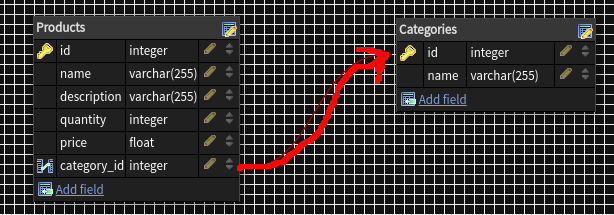

# ACTIVE RECORD ASSOCIATIONS
Rails'de ilişkilendirme, iki Aktif Kayıt modeli arasındaki bağlantıdır.
Modeller arasında neden ilişkilendirmelere ihtiyacımız var? Çünkü kodunuzda yaygın 
işlemleri daha basit ve kolay hale getirirler. Örneğin, ürünler için bir model ve 
kategoriler için bir model içeren basit bir Rails uygulamasını düşünün.
Her kategorinin birçok ürünü olabilir. Bu ilişkilerin varlığını projemizde belirtmemiz ve 
kodlarımızı bu ilişkilere göre yazmamız gerekir.

## belongs_to (aitlik)

Fotoğrafta görüldüğü üzere Products tablosu category_id' yi foreign key
olarak almıştır. Yani her bir ürün bir kategoriye aittir.
`belongs_to :category`

## has_many (kapsar,sahiptir)
Yukarıdaki örnek tablolarda her ürünün bir categorye ait olması
gerektiğini söylemiştik. Dolayısıyla category ler ürünleri barındırır.
Birden çok ürünü barındırabileceği için has_many kullanırız.
`has_many :products`

## has_one (one_to_one)
Eğer tek bir ürün tek bir kategoriye ait olmak zorundaysa bu tarz 
ilişkiler has_one ilişkilerdir.
`has_one :product`

örnekler category.rb ve product.rb