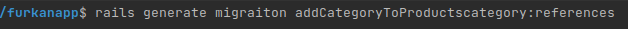
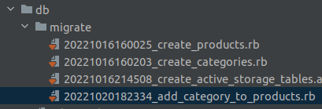
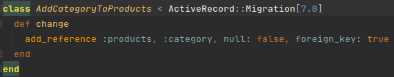
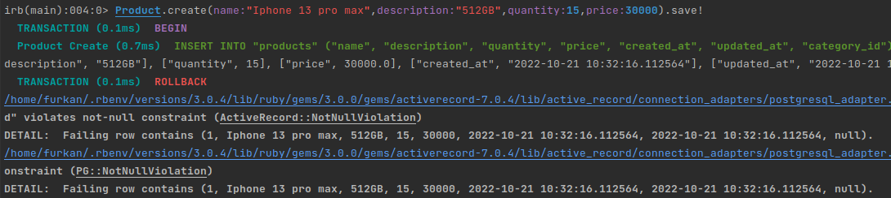
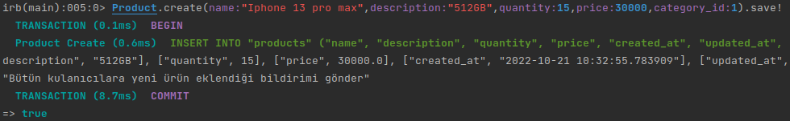

# ACTIVE RECORD MIGRATIONS
Veritabanındaki model dosyalarımızı eşleştirmek için yeni bir migration dosyası
oluşturmamız gerekir.

  
bu komut ile birlikte Products tablosuna categorynin referansını ekleyeceğimizi söylüyoruz.
 
 
 
  
db/migrate altında migration dosyamız oluştu.
 
 
 
  
Migration dosyamızın içeriği bu şekilde. (null bırakılamaz, foreign key mi? evet)
 
 
 
`rails db:drop`,`rails db:create`,`rails db:migrate` komutlarıyla veri tabanımızı sıfırlayıp tekrardan migrate ediyoruz.
 
 
 
  
rails console ekranımıza gelip, bir category modeli oluşturduktan sonra bir prodcut oluşturmak istediğimizde
category_id belirtmemiz gerekir. Eğer category_id boş bırakırsak yukarıda görüldüğü gibi "null bırakılamaz"
hatası verir.
 
 
 

`category_id:1` ifadesini girdiğimizde product'ımızı id'si 1 olan categorye eşlemiş olur.