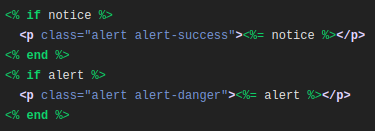
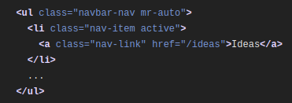

# DEVISE GEM
Devise gemi rails üzerinde bize esnek yetkilendirme çözümlerini
sunan bir gemdir. Bütün kullanıcı ile ilgili yapıları yönetmemizi sağlar.

## Kurulum
- Gemfile dosyamızı açıyoruz ve içerisine `gem 'devise'`
yazıyoruz.
- Terminalimize `bundle install` diyerek gemlerimizi indiriyoruz.
- `rails generate devise:install` yazarak gerekli yapıyı oluşturuyoruz.
## Yapılandırma
- `config/environments/development.rb` dosyamızın içine gidip 
`config.action_mailer.default_url_options = { host: 'localhost', port: 3000 }`
yapıştırıyoruz.
- `app/views/layouts/application.html.erb` dosyasına gidip  
  
ifadesini yapıştırıyoruz.
- `app/views/ideas/show.html.erb` dosyasına gidip
`
<%= notice %>
` yapıştırıyoruz.
aynı işlemi `app/views/comments/show.html.erb` dosyasında da
gerçekleştiriyoruz.

## User Modeli Oluşturma
`rails g devise user` `rails db:migrate` komutlarıyla
user modelimizi oluşturduk.
## İlk User'imizi Oluşturalım
Artık her şeyi ayarladığımıza göre ilk kullanıcımızı oluşturalım.
Devise, hesap oluşturmak, oturum açmak, oturumu kapatmak vb. için gereken tüm kodu ve yolları oluşturur.
Rails sunucunuzun çalıştığından emin olalım,
http://localhost:3000/users/sign_up açalım ve kullanıcı hesabını oluşturalım.
## Kayıt ve Giriş Bağlantıları Ekleme
Şimdi tek yapmamız gereken, navigasyon çubuğunun sağ üst köşesine uygun
bağlantılar veya giriş yapan kullanıcı hakkında uyarı eklemek.
Bunu yapmak için `app/views/layouts/application.html.erb` dosyasına gidiyoruz ve  
  
yazıyoruz. Hemen sonrasında  
  
yazıyoruz.    
Son olarak, kullanıcı oturum açmadıysa, kullanıcıyı oturum açma sayfasına yönlendirmeye zorlauyoruz.
`app/controllers/application_controller.rb` dosyasına gidip ` before_action :authenticate_user!` ekliyoruz

